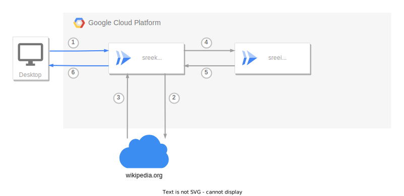

# Sreetcode

Or Sreekipedia

A package to "Sreefy&trade;" any website.

## Design

- sreekipedia: (go cloud run) Web server responsible for retrieving wikipedia page and handling requests.
- sreeifier: (python cloud run) gRPC server responsible for sreefying the content.

1. User requests a page from sreekipedia.
2. sreekipedia requests relevant wikipedia page from wikipedia.
3. sreekipedia receives the page.
4. sreekipedia sends the page to sreeifier.
   a. sreeifier sreefies the page.
5. sreeifier sends the sreefied page back to sreekipedia.
6. sreekipedia sends the sreefied page to the user.

Sreekipedia <--> Sreeifier communication is done using gRPC bidirectional streaming.
